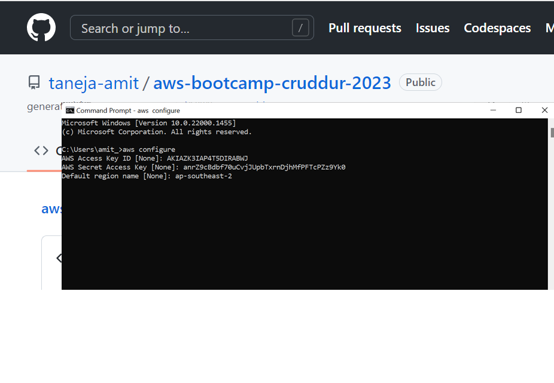
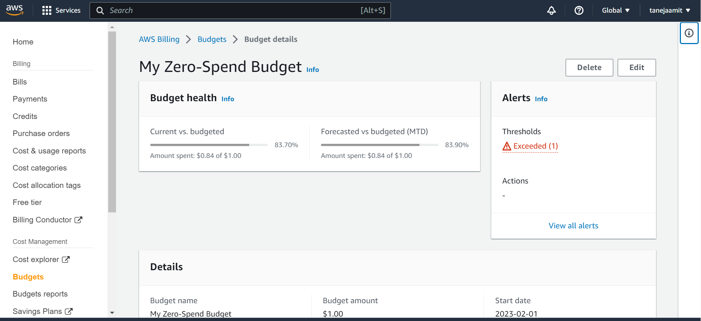
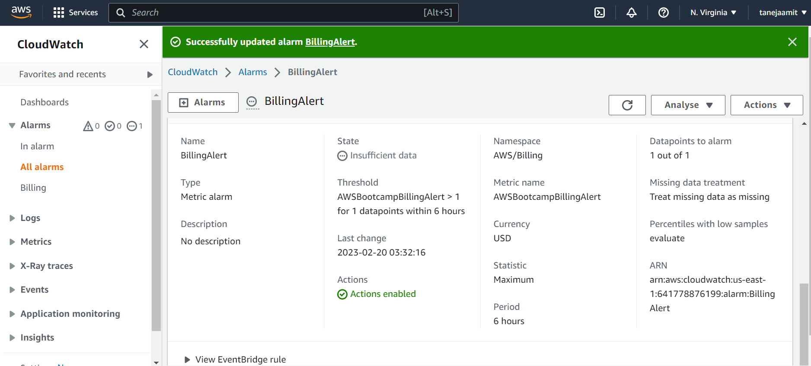
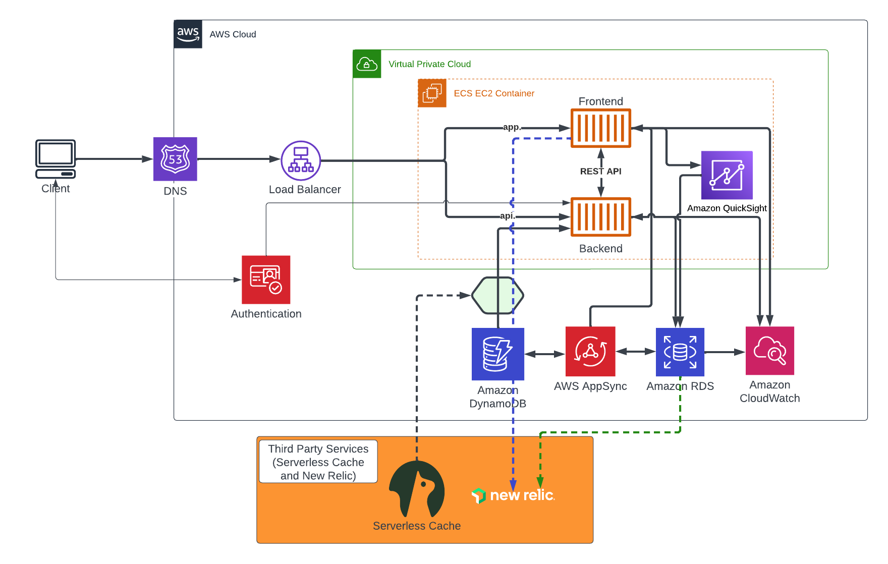

# Week 0 — Billing and Architecture

## Required Homework/Tasks

### Install and verify AWS CLI works successfully
I installed AWS CLI on my local Windows environment. I documented all the steps in the attached document and ensure that it works.

[Proof of AWS CLI Installation - Document](assets/week0/StepsToInstallAWS_CLI.docx)

### Create Budget

I created a $1 budget to minimise the spend. 

### Create Billing Alarm

I created a billing alarm with all the required parameters set. 

### Recreate Logical Architecture Diagram

[Lucid Charts Shared Link](https://lucid.app/lucidchart/cc2bb1c5-6e26-4d1f-a446-469753f3ee1b/edit?view_items=pcFBHJV-hF5V&invitationId=inv_5149cd28-e901-4751-9462-a3971608b6f8)
